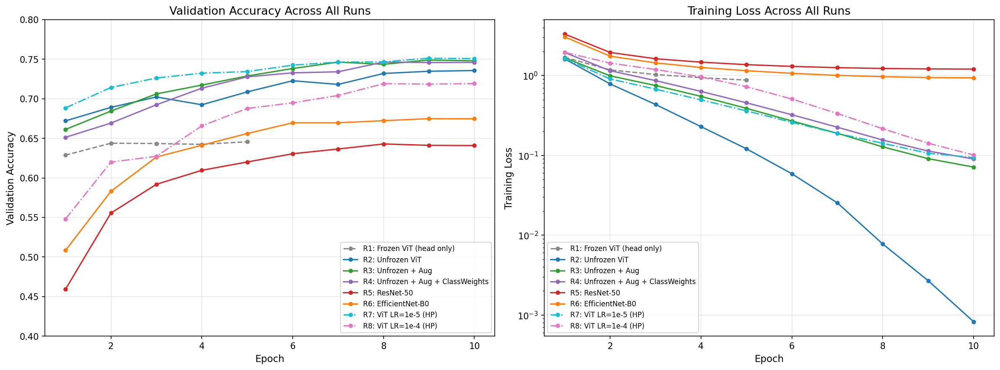
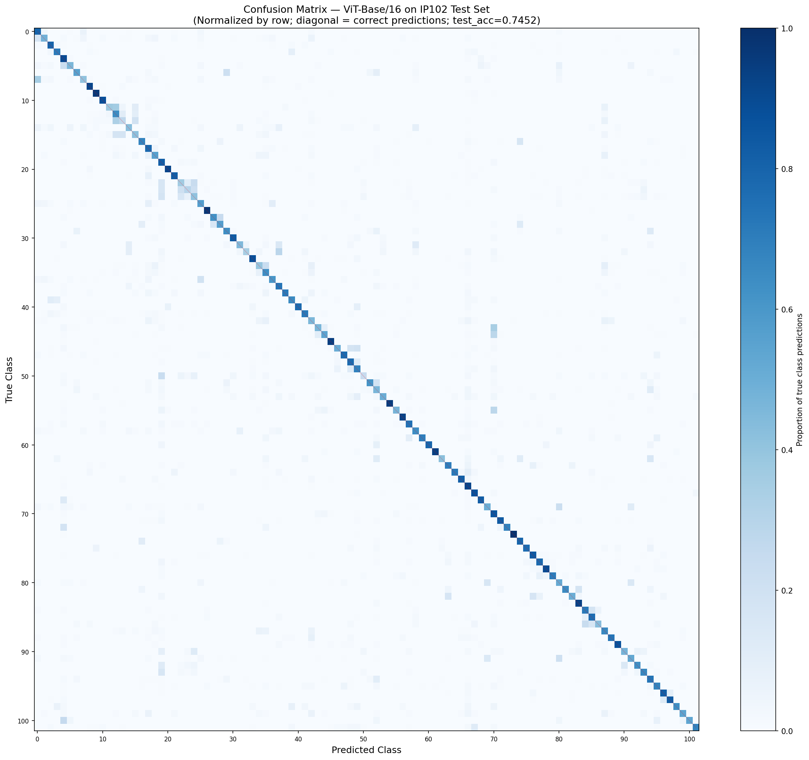
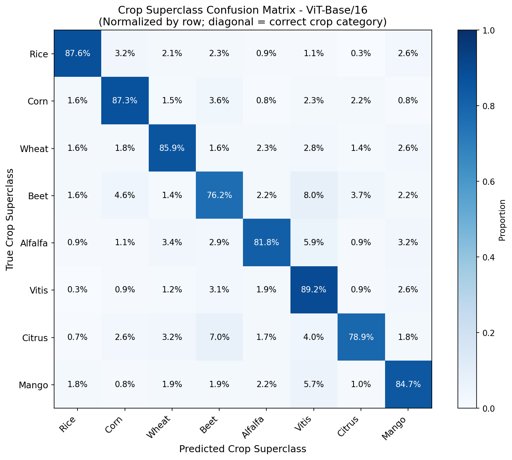
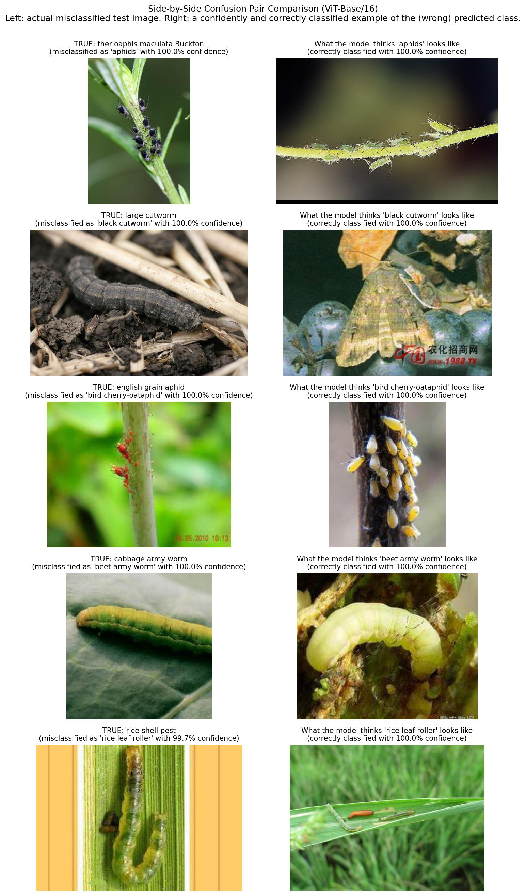
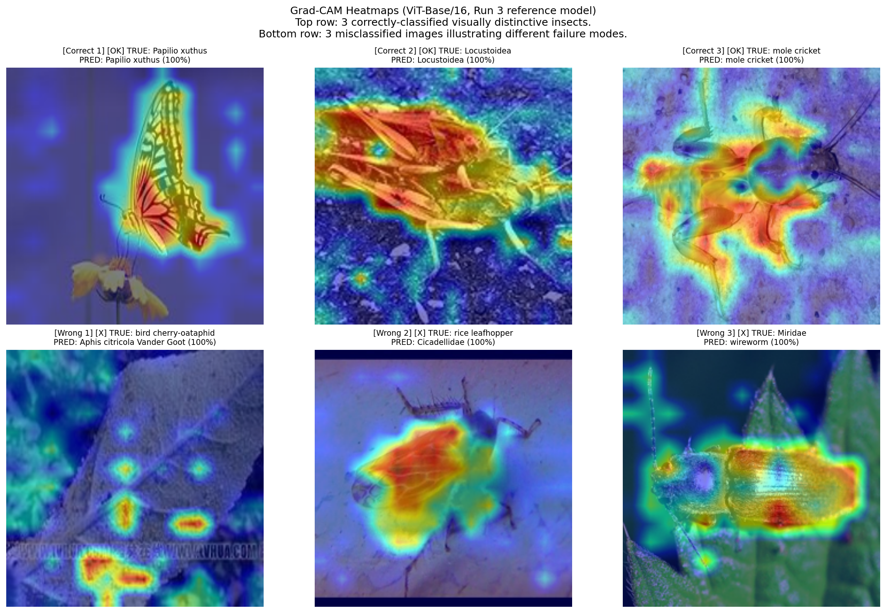

# Pest Classifier: Insect Pest Identification with IP102

An AI system that identifies 102 species of crop-destroying insects from a single photograph. Built by fine-tuning a Vision Transformer (ViT-Base/16) on the IP102 benchmark dataset.Helps with real-world agricultural pest identification.

## What it Does

This project classifies images of crop-destroying insects into 102 species across 8 major crop categories (Rice, Corn, Wheat, Beet, Alfalfa, Vitis, Citrus, Mango). Given a photograph of an insect, the system outputs the predicted species and confidence score. Best test accuracy is **74.76%** (single model) and **75.45%** (3-architecture ensemble) on the held-out IP102 test set of 22,619 images. At the crop-superclass level, accuracy reaches **84.0%**. The project is designed to demonstrate fine-grained image classification, transfer learning, ablation methodology, and interpretability analysis on a long-tailed real-world dataset.

---

## Quick Start

### 1. Clone the Repository

git clone https://github.com/Selinbildirici/pest-classifier.git
cd pest-classifier

### 2. Install Dependencies
pip install -r requirements.txt

### 3. Get a Kaggle API token

The IP102 dataset is hosted on Kaggle. Get your `kaggle.json` from https://www.kaggle.com/settings → API → Create New Token. Place it at `~/.kaggle/kaggle.json` and run `chmod 600 ~/.kaggle/kaggle.json`.

### 4. Open the notebook

The main entry point is `notebooks/pest_classifier.ipynb`. Recommended to run on Google Colab Pro with a T4 GPU. The notebook contains all 8 training runs, evaluation, and analysis cells, organized into three phases (ablation study, architecture comparison, hyperparameter tuning) followed by analysis sections.

For full setup details, dataset download instructions, and access to trained checkpoints, see [SETUP.md](SETUP.md).

---

## Video Links

- **Demo Video** (3–5 min, non-technical overview): (https://youtu.be/R5p_oWp4TsU)
- **Technical Walkthrough** (5–10 min, code and methodology): https://youtu.be/4RjNLziJhLQ

---

## Evaluation

### Approach

I approached this as a fine-grained image classification problem on a long-tailed dataset. The methodology was structured in three sequential phases:

**Phase 1 — Ablation Study on ViT-Base/16:** Four training configurations isolating one variable at a time. Run 1 (frozen) → Run 2 (unfrozen) → Run 3 (unfrozen + augmentation) → Run 4 (+ class weighting). This phase identified that backbone unfreezing was the largest single improvement (+9 points).

**Phase 2 — Architecture Comparison:** Using the best Phase 1 configuration (unfrozen ViT with augmentation), I trained ResNet-50 and EfficientNet-B0 with identical training configurations to enable fair architectural comparison.

**Phase 3 — Hyperparameter Tuning:** Three backbone learning rates on our best architecture (ViT) to characterize sensitivity: 1e-5, 3e-5, 1e-4. The 1e-5 run produced the best test accuracy (74.76%); the 1e-4 run showed clear degradation.

I then performed comprehensive **post-hoc analysis**: confusion matrix at species and crop-superclass levels, per-class F1 score analysis, error analysis on top confusion pairs, Grad-CAM interpretability, and a softmax-averaging ensemble across the three architectures.

### Training Configuration

- **Backbone:** Pretrained on ImageNet, fine-tuned end-to-end (unless frozen for ablation)
- **Optimizer:** AdamW with differential learning rates (head: 3e-4, backbone: 3e-5)
- **Weight decay:** 0.05
- **Scheduler:** Linear warmup (500 steps) + cosine annealing
- **Mixed precision:** torch.amp.autocast + GradScaler
- **Batch size:** 16 (ViT), 32 (CNNs) — limited by T4 GPU memory
- **Epochs:** 10 with early stopping (patience 3 on val accuracy)
- **Loss:** CrossEntropyLoss (with class weights only in Run 4)
- **Hardware:** Google Colab Pro, NVIDIA T4 GPU

### Data Augmentation Pipeline

Five Albumentations techniques used in Runs 3–8: RandomResizedCrop (scale 0.7–1.0), HorizontalFlip (p=0.5), RandomRotate90 (p=0.5), ColorJitter (brightness/contrast/saturation 0.2, hue 0.05, p=0.7), and CoarseDropout (1–3 holes, 8–32 px each, p=0.3).

### Headline Results

| Model | Test Accuracy |
|-------|---------------|
| ViT-Base/16 (Run 3, reference model) | 74.52% |
| ResNet-50 (Run 5) | 64.23% |
| EfficientNet-B0 (Run 6) | 67.20% |
| ViT-Base/16, HP-tuned LR=1e-5 (Run 7, best single) | **74.76%** |
| **3-architecture ensemble (val-weighted)** | **75.45%** |

### Ablation Study (ViT-Base/16)

Each row changes one variable from the previous configuration to isolate its effect.

| Run | Configuration | Val Acc | Test Acc | Δ vs prev |
|-----|---------------|---------|----------|-----------|
| 1 | Frozen backbone (head only) | 64.6% | — | baseline |
| 2 | Unfrozen backbone | 73.6% | — | **+9.0%** |
| 3 | Unfrozen + 5-technique augmentation | 74.9% | 74.52% | +1.3% |
| 4 | + class weighting | 74.6% | — | -0.3% |

**Key finding:** Backbone unfreezing produced the single largest improvement (+9.0%). Augmentation added a smaller but consistent gain. Class weighting showed no measurable improvement at the overall accuracy level.

### Architecture Comparison

All architectures trained with identical configuration (augmentation, no class weighting, head LR 3e-4, backbone LR 3e-5).

| Architecture | Parameters | Val Acc | Test Acc |
|--------------|-----------|---------|----------|
| ViT-Base/16 | 85.9M | 74.9% | **74.52%** |
| ResNet-50 | 23.7M | 64.3% | 64.23% |
| EfficientNet-B0 | 4.1M | 67.5% | 67.20% |

**Key finding:** ViT outperforms convolutional architectures by 7–10 percentage points on this fine-grained classification task. EfficientNet-B0 achieves 67.2% with only 4.1M parameters, beating the much larger ResNet-50 — modern architectural innovations (depthwise separable convolutions, compound scaling) provide real efficiency gains.

### Hyperparameter Tuning (Backbone Learning Rate)

| Run | Backbone LR | Val Acc | Test Acc | Notes |
|-----|-------------|---------|----------|-------|
| 7 | 1e-5 (low) | 75.1% | **74.76%** | Marginal best |
| 3 | 3e-5 (baseline) | 74.9% | 74.52% | Reference |
| 8 | 1e-4 (high) | 71.9% | — | Clearly degraded (-3% on val) |

**Key finding:** ViT fine-tuning is robust to learning rate within a 3× range (1e-5 to 3e-5) but degrades sharply at 10× higher rate. The 0.2% gap between Run 7 and Run 3 is within run-to-run variance and should not be interpreted as meaningful improvement.

### Per-Class Performance

- Mean per-class F1: **0.680** (median 0.711)
- 18 of 102 classes (17.6%) had F1 below 0.5
- 9 classes (8.8%) had F1 above 0.9
- Best class: Papilio xuthus (swallowtail butterfly, F1 = 0.971)
- Worst class: therioaphis maculata Buckton (F1 = 0.284)

The 6.5-point gap between mean per-class F1 (0.680) and overall test accuracy (74.5%) reflects long-tail bias: the model performs better on common classes than rare ones.

### Crop Superclass Performance (8×8 Aggregated)

| Crop Category | Per-superclass Accuracy |
|---------------|-------------------------|
| Vitis | 89.2% |
| Rice | 87.6% |
| Corn | 87.3% |
| Wheat | 85.9% |
| Mango | 84.7% |
| Alfalfa | 81.8% |
| Citrus | 78.9% |
| Beet | 76.2% |

**Mean superclass accuracy: 84.0%** — a 10-point gap above species-level accuracy (74.5%). Most errors are within-crop fine-grained confusions, not cross-crop misidentifications. For agricultural applications, this means the model is reliable enough for crop-category intervention decisions even when species-level identification is uncertain.

### Training Curves

### Confusion Matrices

Full 102×102 species-level confusion matrix (left) and aggregated 8×8 crop superclass matrix (right):

| Species-level | Crop superclass-level |
|:-:|:-:|
|  |  |

### Error Analysis: Top Confusion Pairs

I analyzed the top confusion pairs of our reference ViT model and identified four distinct failure modes:

**1. Fine-grained intra-genus confusion (dominant).** Aphid species are the model's most challenging category. Five of the worst ten classes by F1 are aphids, and they are overwhelmingly confused with each other rather than with non-aphid species. Examples: *therioaphis maculata Buckton* (worst, F1=0.28) → "aphids" 23.1% of the time; *english grain aphid* → *bird cherry-oat aphid* 23.9% of the time. A similar pattern exists for cutworm species (*large cutworm* → *black cutworm* 32.4% of the time). These confusions reflect the inherent difficulty of distinguishing visually similar species within a genus, distinctions that often require expert entomological knowledge.

**2. Lifecycle-stage / dataset structure confusion.** The IP102 dataset groups all life stages of a species under a single label, so '*black cutworm*' and '*large cutworm*' both contain larval caterpillars and adult moths. The model has correctly learned this grouping but cannot distinguish caterpillars across these two related Lepidopteran species, which appear nearly identical as larvae.

**3. Contextual / dataset-imbalance bias.** '*Rice shell pest*' is misclassified as '*rice leaf roller*' 35.0% of the time. Both species occur as caterpillars on rice plants. The shared visual context (rice foliage, green caterpillar silhouette) combined with the strong class-frequency prior of rice leaf roller (1700+ training images, IP102's most frequent class) pulls predictions toward the dominant class.

**4. Class-label ambiguity.** '*Therioaphis maculata Buckton*' is misclassified as the general '*aphids*' class. Because '*aphids*' is a coarse semantic category that overlaps with several specific aphid species, this confusion reflects label structure ambiguity rather than purely visual error.

These four failure modes suggest different remediation strategies: fine-grained losses (e.g., triplet loss with within-genus negatives) could help with Modes 1 and 2; class-rebalancing or focal loss could address Mode 3; and clearer label hierarchies (or hierarchical classification) could address Mode 4.

### Interpretability: Grad-CAM Analysis

Grad-CAM heatmaps for our reference ViT model show **two distinct attention patterns** in failures.

For **correct predictions** on visually distinctive insects (Papilio xuthus swallowtail butterfly, Locustoidea locust, mole cricket), Grad-CAM concentrates attention on the insect's body. The swallowtail butterfly shows tight focus on the wings; the locust shows uniform attention across its full body; the mole cricket shows attention tracing its distinctive body morphology. These cases confirm that for visually distinctive species the model relies on relevant visual features rather than spurious context.

**Failure mode A: Attention failure for tiny insects.** For the *bird cherry-oat aphid → Aphis citricola* misclassification, Grad-CAM concentrates on leaf texture and image watermarks rather than the small aphids themselves. When insects are small relative to the image and visually similar to background, the model fails to localize them, leading to fine-grained errors driven by leaf-texture biases.

**Failure mode B: Discrimination failure for similar species.** For *rice leafhopper → Cicadellidae* and *Miridae → wireworm*, the heatmaps focus tightly on the insect's body (the model successfully localizes the insect) but the final species prediction is wrong. This indicates the model's attention mechanism works correctly, but the feature representations lack the fine-grained resolution required to distinguish closely-related species.

These two failure modes suggest different solutions: small-object attention problems could be addressed through attention regularization or higher-resolution input; fine-grained discrimination problems could be addressed through fine-grained classification losses or hierarchical labels.

### Ensemble

I tested three softmax-averaging ensemble strategies combining ViT-Base/16, ResNet-50, and EfficientNet-B0:

| Strategy | Test Accuracy | Δ vs ViT alone |
|----------|---------------|----------------|
| ViT alone (Run 3) | 0.7452 | baseline |
| Uniform average | 0.7534 | +0.82% |
| **Validation-accuracy weighted** | **0.7545** | **+0.93%** |
| ViT-heavy (2× ViT) | 0.7533 | +0.81% |

**Key finding:** The val-weighted ensemble achieves 75.45% test accuracy, a +0.93% improvement over the best single model (ViT at 74.52%). All three strategies produce gains within 0.12 points of each other, indicating the improvement is robust. This corresponds to ~210 additional correctly-classified test images (out of 22,619), suggesting that error patterns between transformer-based and convolutional architectures differ meaningfully on this task — the ensemble exploits this complementarity.

### Limitations

I did not set explicit random seeds for the experiments. When I realized this, it was unfortunately a bit lat. PyTorch's default non-deterministic behavior was used throughout, meaning weight initialization, data shuffling, and augmentation sampling varied across runs. As a result, small differences (<1%) between runs may reflect run-to-run variance rather than meaningful effects. Specifically, the 0.3% drop from Run 3 to Run 4 (class weighting) and the 0.2% gap from Run 3 to Run 7 (HP tuning) are within typical noise. Larger effects (the 9-point ablation gain, the 10-point ViT vs ResNet gap, the 3-point degradation at LR=1e-4, the +0.93% ensemble gain) remain robust under any reasonable variance assumption.

I tuned only the backbone learning rate, a complete hyperparameter sweep would also explore weight decay, warmup schedule, and augmentation intensity. I compared one architecture per family (ViT, ResNet, EfficientNet). A more thorough comparison would include modern hybrid architectures (Swin, ConvNeXt) and self-supervised backbones (DINOv2, MAE). Reported results are single-run. Multi-seed averaging with confidence intervals would strengthen all comparisons.

### Future Work

Multi-seed averaging for statistical confidence intervals, fine-grained classification losses (triplet loss with within-genus negatives) for aphid/cutworm clusters, attention regularization to reduce reliance on background features for tiny-insect classes, hierarchical classification leveraging IP102's natural crop superclass structure, and comparison against modern hybrid architectures (Swin, ConvNeXt) and self-supervised backbones (DINOv2, MAE).
